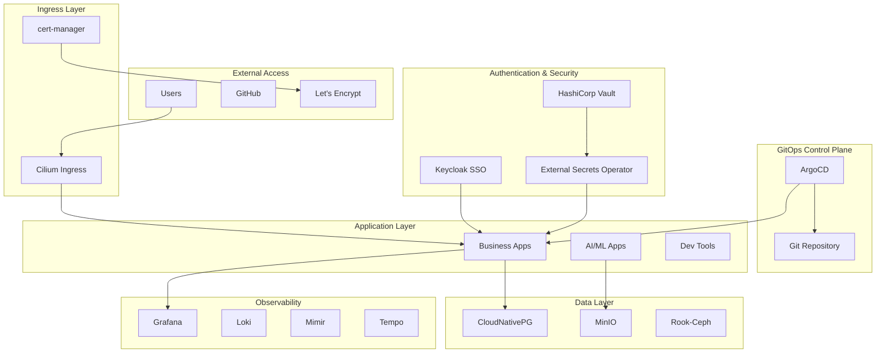

# Howard On-Premises Platform

A production-ready, GitOps-driven Kubernetes platform for the Canadian Food Inspection Agency (CFIA/ACIA), designed to host AI/ML workloads and enterprise applications with strict security and compliance requirements.

## 📋 Table of Contents

- [About the Project](#-about-the-project)
- [Architecture Overview](#️-architecture-overview)
- [Technology Stack](#-technology-stack)
- [How Components Work Together](#-how-components-work-together)
- [Project Structure](#-project-structure)
- [Getting Started](#-getting-started)
- [Security Features](#-security-features)
- [Monitoring and Observability](#-monitoring-and-observability)
- [Contributing](#-contributing)
- [License](#-license)

## 🎯 About the Project

The Howard On-Premises Platform is a comprehensive Kubernetes infrastructure solution that provides:

- **Enterprise-grade AI/ML platform** for food inspection and safety applications
- **Multi-tenant environment** with strict security boundaries
- **GitOps-based deployment** for declarative infrastructure management
- **Full-stack observability** with centralized logging, metrics, and tracing
- **Government compliance** meeting strict regulatory requirements

### Key Business Applications

- **Fertiscan**: Fertilizer inspection and analysis system
- **Nachet**: Insect identification using ML models for pest detection
- **Louis**: Comprehensive AI platform with LLM capabilities, RAG, and research tools
- **LibreChat**: Multi-model AI chat interface for internal use
- **Finesse**: Internal management and workflow applications

## 🏗️ Architecture Overview



## 💻 Technology Stack

### Core Infrastructure

| Component | Purpose | Version/Details |
|-----------|---------|-----------------|
| **Kubernetes** | Container orchestration | v1.28+ |
| **ArgoCD** | GitOps deployment | v8.3.0 |
| **Cilium** | CNI & Service Mesh | eBPF-based networking |
| **Rook-Ceph** | Distributed storage | Hot (SSD) & Cold tiers |

### Security & Authentication

| Component | Purpose | Configuration |
|-----------|---------|---------------|
| **Keycloak** | SSO/Identity provider | OIDC for all services |
| **Vault** | Secrets management | Auto-unseal enabled |
| **cert-manager** | TLS certificates | Let's Encrypt production |
| **Trivy** | Vulnerability scanning | Continuous scanning |
| **Cosign** | Container signing | Image verification |

### Data Management

| Component | Purpose | Features |
|-----------|---------|----------|
| **CloudNativePG** | PostgreSQL operator | HA clusters with auto-backup |
| **MinIO** | S3-compatible storage | Distributed mode |
| **Velero** | Backup & DR | Cluster-level backups |

### Observability Stack

| Component | Purpose | Retention |
|-----------|---------|-----------|
| **Grafana** | Dashboards & visualization | SSO integrated |
| **Loki** | Log aggregation | 30 days |
| **Mimir** | Metrics storage | 60 days |
| **Tempo** | Distributed tracing | 60 days |
| **Grafana Alloy** | Unified telemetry collector | All nodes |

### AI/ML Infrastructure

| Component | Purpose | Features |
|-----------|---------|----------|
| **NVIDIA GPU Operator** | GPU management | Time-slicing support |
| **MLflow** | ML experiment tracking | Model registry |
| **Triton** | Model inference server | Multi-framework support |
| **vLLM** | LLM inference | High-performance serving |
| **Ollama** | Local LLM runtime | Multiple model support |

## 🔄 How Components Work Together

### 1. **GitOps Workflow**

```text
Developer → Git Push → ArgoCD → Kubernetes → Application
                           ↓
                     Sync & Reconcile
```

- Developers commit changes to Git repository
- ArgoCD monitors repository for changes
- Automatic synchronization deploys updates
- Self-healing ensures desired state

### 2. **Security Flow**

```text
User → Keycloak Auth → Application → Vault (via ESO) → Secrets
           ↓                              ↓
      OIDC Token                    K8s Secrets
```

- All applications use Keycloak for SSO
- Vault stores sensitive credentials
- External Secrets Operator syncs to Kubernetes
- TLS everywhere via cert-manager

### 3. **Data Pipeline**

```text
Application → PostgreSQL (Primary)
     ↓              ↓
  MinIO         Backup
     ↓              ↓
  Ceph         Barman/MinIO
```

- Applications use CloudNativePG for databases
- Automatic backups to MinIO
- Rook-Ceph provides persistent volumes
- Velero handles disaster recovery

### 4. **Observability Pipeline**

```text
Application → Alloy Agent → Loki (Logs)
                    ↓     → Mimir (Metrics)  → Grafana
                    ↓     → Tempo (Traces)
              OpenTelemetry
```

- Unified collection via Grafana Alloy
- Centralized storage for all telemetry
- Grafana provides unified visualization
- Alert routing through Grafana

### 5. **AI/ML Workflow**

```text
Data Scientists → Jupyter/AI Lab → Train Model → MLflow
                                        ↓
                                  Model Registry
                                        ↓
                                 Triton/vLLM → API
```

- Shared AI Lab environment for development
- MLflow tracks experiments and models
- Production serving via Triton or vLLM
- GPU resources managed by NVIDIA operator

## 📁 Project Structure

```text
howard-on-prem/
├── apps/                    # Business applications
│   ├── fertiscan/          # Fertilizer inspection app
│   ├── nachet/             # Insect identification
│   ├── louis/              # AI platform components
│   └── ...
├── gitops/                  # GitOps control plane
│   ├── argocd/             # ArgoCD configuration
│   └── on-prem-gh-runners/ # Self-hosted runners
├── security/                # Security components
│   ├── cert-manager/       # TLS management
│   ├── keycloak/           # Identity provider
│   └── vault/              # Secrets management
├── storage/                 # Storage solutions
│   ├── cloudnativepg/      # PostgreSQL operator
│   ├── minio/              # Object storage
│   └── rook-ceph/          # Distributed storage
├── networking/              # Network configuration
│   └── cilium/             # CNI and service mesh
├── monitoring/              # Observability stack
│   ├── grafana-lgtm/       # LGTM stack
│   └── metrics/            # Metrics collection
├── mlops/                   # ML infrastructure
│   ├── mlflow/             # Experiment tracking
│   └── nvidia/             # GPU support
└── terraform/               # Infrastructure as Code
```

## 🚀 Getting Started

### Prerequisites

- Kubernetes cluster (v1.28+)
- Git repository access
- ArgoCD CLI installed
- kubectl configured

### Initial Setup

### 1. **Bootstrap ArgoCD**

```bash
kubectl create namespace argocd
kubectl apply -k gitops/argocd/
```

### 2. **Configure Git Repository**

```bash
argocd repo add https://github.com/your-org/howard-on-prem \
  --username <username> \
  --password <token>
```

### 3. **Deploy Applications**

```bash
kubectl apply -f gitops/argocd-apps/
```

### 4. **Access ArgoCD UI**

```bash
kubectl port-forward svc/argocd-server -n argocd 8080:443
# Navigate to https://localhost:8080
```

### Environment Configuration

Each environment (dev/staging/prod) can be configured through:

- Kustomize overlays for environment-specific values
- Helm values files in respective directories
- ArgoCD ApplicationSets for multi-environment deployments

## 🔒 Security Features

### Defense in Depth

1. **Network Security**
   - Cilium network policies
   - Service mesh with mTLS
   - Ingress with rate limiting

2. **Identity & Access**
   - Keycloak SSO with MFA support
   - RBAC at multiple levels
   - Service account restrictions

3. **Secrets Management**
   - Vault for centralized secrets
   - Encrypted at rest and in transit
   - Automatic rotation capabilities

4. **Container Security**
   - Image scanning with Trivy
   - Signed images with Cosign
   - Security policies enforcement
   - Read-only root filesystems

5. **Compliance & Auditing**
   - Audit logging enabled
   - Compliance scanning
   - Regular security updates via Renovate

## 📊 Monitoring and Observability

### Available Dashboards

- **Infrastructure**: Node health, resource usage, network traffic
- **Applications**: Request rates, error rates, latencies
- **Security**: Authentication events, policy violations
- **ML/AI**: GPU utilization, model performance, inference metrics

### Alerting

Configured alerts for:

- Resource exhaustion
- Application errors
- Security events
- Backup failures
- Certificate expiration

### Access Points

- Grafana: `https://grafana.inspection.alpha.canada.ca`
- ArgoCD: `https://argocd.inspection.alpha.canada.ca`
- Keycloak: `https://keycloak.inspection.alpha.canada.ca`

## 🤝 Contributing

1. Fork the repository
2. Create a feature branch
3. Commit your changes
4. Push to the branch
5. Create a Pull Request

All changes are deployed through GitOps - direct cluster modifications are discouraged.

### Development Workflow

1. Make changes in feature branch
2. Test in development environment
3. Create PR for review
4. Merge triggers ArgoCD sync
5. Monitor deployment in ArgoCD

## 📄 License

This project is licensed under the MIT License - see the [LICENSE](LICENSE) file for details.

## 📞 Support

For issues and questions:

- Create an issue in the repository
- Contact the DevSecOps team
- Check the documentation in `/docs`

---

**Maintained by**: CFIA/ACIA DevSecOps Team  
**Last Updated**: 2025
